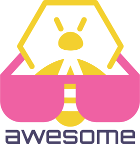

   
  
   
   

# Awesome TheHive 

> A curated list of awesome things related to [TheHive](#thehive) &amp; [Cortex](#cortex)

## TheHive

- [Official Resources](#official-resources)
- [Libraries](#libraries)
- [Integrations](#integrations)
- [Tools](#tools)
- [Devops](#devops)
- [Blogs & Articles](#blogs-articles)

### Official Resources

- [Web Site](https://thehive-project.org)
- [Official Blog](https://blog.thehive-project.org)
- [Official Docs](https://github.com/TheHive-Project/TheHiveDocs)
- [GitHub Repo](https://github.com/TheHive-Project/TheHive)
- [Release Notes](https://github.com/TheHive-Project/TheHive/releases)

### Libraries

- [TheHive4Py](https://github.com/TheHive-Project/TheHive4py) - Official TheHive API client written in Python
- [thehive.js](https://github.com/TheHive-Project/thehive.js) - TheHive API client written in Javascript (WIP)
- [hive4go](https://github.com/frikky/hive4go) - A Golang API for TheHive, by [@frikky](https://github.com/frikky)
- [go-thehive](https://github.com/ilyaglow/go-thehive) - A Golang API for TheHive, by [@ilyaglow](https://github.com/ilyaglow)
- [TheHive4PS](https://github.com/vi-or-die/TheHive4PS) - PowerShell functions to interact with TheHive API, by [@vi-or-die](https://github.com/vi-or-die)
- [TheHive4node](https://www.npmjs.com/package/thehive4node) - TheHive API client written in Node (WIP), by [@agix](https://github.com/agix)

### Integrations

- [Synapse](https://github.com/TheHive-Project/Synapse) - Meta Alert feeder, inluding Qradar and Exchange connectors
- [DigitalShadows2TH](https://github.com/TheHive-Project/DigitalShadows2TH) - Alert feeder for DigitalShadows
- [Zerofox2TH](https://github.com/TheHive-Project/Zerofox2TH) - Alert feeder for ZeroFox
- [CrowdStrike2TH](https://github.com/theCanary/CrowdStrike2TH) - Alert feeder for CrowdStrike, by [@xg5-simon](https://github.com/xg5-simon)
- [FireEye2TH](https://github.com/LDO-CERT/FireEye2TH) - FireEye iSIGHT Alert Feeder for TheHive, by [@LDO-CERT](https://github.com/LDO-CERT)
- [graylog2thehive](https://github.com/ReconInfoSec/graylog2thehive) - Alert feeder for Graylog, by [@ReconInfoSec](https://github.com/ReconInfoSec)
- [mailgun2thehive](https://github.com/ReconInfoSec/mailgun2thehive) - Simple Python flask app that runs as a web server, and accepts POST requests from your Mailgun routes, by [@ReconInfoSec](https://github.com/ReconInfoSec)
- [qradar2thehive](https://github.com/pierrebarlet/qradar2thehive) - Alert feeder for Qradar, by [@pierrebarlet](https://github.com/pierrebarlet)
- [TA-thehive-CE](https://github.com/remg427/TA-thehive-ce) - Splunk Application for TheHive, by [@remg427](https://github.com/remg427)
- [thehiveemail](https://github.com/ReconInfoSec/thehiveemail) - Reading and processing of email folders for TheHive + Autoupdating case histories, by [@ReconInfoSec](https://github.com/ReconInfoSec)
- [thehive-falcon](https://github.com/ag-michael/thehive-falcon) - Falcon streaming api alert integration for TheHive, by [@ag-michael](https://github.com/ag-michael)
- [Elastalert TheHive alerter](https://github.com/Nclose-ZA/elastalert_hive_alerter) - Elastalert connector for TheHive, by [@Nclose-ZA](https://github.com/Nclose-ZA)
- [StackStorm](https://github.com/StackStorm-Exchange/stackstorm-thehive) - TheHive pack for StackStorm
- [TheHive Opendxl](https://www.opendxl.com/filebase/index.php?file/92-thehive-dxl-python-service/) - TheHive service for use with the OpenDXL Python Client
- [TheHive OpenAPI definition](https://github.com/frikky/OpenAPI-security-definitions/blob/master/thehive.yaml) - OpenAPI definition for TheHive, by [@frikky](https://github.com/frikky)
- [thehive-slack-webhook](https://github.com/ReconInfoSec/thehive-slack-webhook) - A simple Lambda function for delivering The Hive webhooks to Slack, by [ReconInfoSec](https://github.com/ReconInfoSec)
- [TheHive2Sigma](https://github.com/jordisk/TheHive2Sigma) - Python script to automatically create sigma rules from Thehive observables, by [@jordisk](https://github.com/jordisk)
- [TheHive WALKOFF app](https://github.com/frikky/WALKOFF/tree/thehive-integration) - A TheHive WALKOFF application, by [@frikky](https://github.com/frikky)
- [Cyrating Feeder](https://github.com/vletoux/Cyrating2TH) - Cyrating Reputation alert importer for TheHive, by [vletoux](https://github.com/vletoux)
- [Canaries to TheHive](https://github.com/ReconInfoSec/canaries2thehive) - Create alerts in TheHive from your Thinkst Canary alerts, to be turned into TheHive cases, by [ReconInfoSec](https://github.com/ReconInfoSec)
- [Watcher](https://github.com/Felix83000/Watcher) - Open Source Cybersecurity Threat Hunting Platform. Developed with Django & React JS, by [@Felix83000](https://github.com/Felix83000)

### Tools

- [Pollen](https://github.com/bromiley/pollen) - A command-line tool for interacting with TheHive, by [@bromiley](https://github.com/bromiley)
- [mihari](https://github.com/ninoseki/mihari) - A sidekick tool for TheHive to monitor malicious hosts, by [@ninoseki](https://github.com/ninoseki)

### Devops

- [itamae_thehive](https://github.com/ninoseki/itamae_thehive) - Automated installation of TheHive/Cortex by using Itamae, by [ninoseki](https://github.com/ninoseki)
- [ansible-thehive 1](https://github.com/drewstinnett/ansible-thehive) - Ansible role for installing TheHive, by [@drewstinnett](https://github.com/drewstinnett)
- [ansible-thehive 2](https://github.com/rhythmictech/ansible-thehive) - Ansible Role for TheHive, by [@rhythmictech](https://github.com/rhythmictech)
- [thehive-standalone](https://github.com/rhythmictech/thehive-standalone) - Terraform module and supporting tools to build and create a fully self-contained instance of TheHive and Cortex, by [@rhythmictech](https://github.com/rhythmictech)

### Blogs & Articles

- [Security Distractions](https://www.securitydistractions.com/category/the-hive/)
- [agood.cloud](https://blog.agood.cloud/)
- [SANS ISC InfoSec Forums](https://isc.sans.edu/forums/diary/IR+using+the+Hive+Project/23099/) - IR using TheHive Project.
- [Chris Sanders blog](https://chrissanders.org/2017/03/case-management-the-hive/) - Investigation Case Management with TheHive, by [@chrissanders88](https://github.com/chrissanders88)
- [Cisco Umbrella blog](https://umbrella.cisco.com/blog/2018/11/12/now-available-hive-cortex-analyzer-and-maltego-transform-for-investigate/) - Hive-Cortex Analyzer and Maltego Transform for Investigate
- [SOAR webhook integration](https://medium.com/@Frikkylikeme/automation-for-everyone-with-thehive-and-walkoff-6691f1343238) - Example integration between TheHive and NSA's [WALKOFF](https://github.com/nsacyber/WALKOFF) project
- [DNS Threat Intelligence for Our Community - DomainTools Iris Integration](https://www.domaintools.com/resources/blog/dns-threat-intelligence-for-our-community) - How to do DNS Threat Intelligence with DomainTools Iris integration in TheHive and Cortex by Paul Sourin.
- [AleSecurity Blog](https://alesecurity.fi/?p=15) - How to use OAuth2/OIDC (OpenID Connect) with TheHive
- [Create and delete training alerts in TheHive](https://www.vanimpe.eu/2020/04/25/create-and-delete-training-alerts-in-thehive/), by Koen Van Impe

### Podcasts

- [NoLimitSecu](https://www.nolimitsecu.fr/thehive/) - A French podcast

## Cortex

- [Official Resources](#official-resources-1)
- [Libraries](#libraries-1)
- [Analyzers & Responders](#analyzers-responders)
- [Tools](#tools-1)
- [Devops](#devops-1)
- [Blogs & Articles](#blogs-articles-1)

### Official Resources

- [Official Docs](https://github.com/TheHive-Project/CortexDocs)
- [GitHub Repo](https://github.com/TheHive-Project/Cortex)
- [Release Notes](https://github.com/TheHive-Project/Cortex/releases)

### Libraries

- [Cortex4Py](https://github.com/TheHive-Project/Cortex4py) - Official Cortex API client written in Python
- [go-cortex](https://github.com/ilyaglow/go-cortex) - Cortex API client written in Golang, by [@ilyaglow](https://github.com/ilyaglow)

### Analyzers & Responders

- [Cortex-Analyzers](https://github.com/TheHive-Project/Cortex-Analyzers) - Official Cortex Analyzers and Responders collection
- [SendEmail](https://github.com/norgalades/SendEmail) - Cortex Responder to send emails from TheHive tasks and logs, by [@norgalades](https://github.com/norgalades)
- [Cortex-Analyzers by @aacgood](https://github.com/aacgood/Cortex-Analyzers) - A collection of Cortex Analyzers and Responders for TheHive/Cortex, by [@aacgood](https://github.com/aacgood)

### Tools

- [cortex-tgbot](https://github.com/ilyaglow/cortex-tgbot) - Threat intelligence Telegram bot based on Cortex engine, by [@ilyaglow](https://github.com/ilyaglow)
- [cortextester](https://github.com/TKCERT/cortextester) - Inspired by cortexutils - a testing framework for Cortex-Analyzers and -Responders, by [@TKCERT](https://github.com/TKCERT)

### Devops

- [ansible-cortex 1](https://github.com/drewstinnett/ansible-cortex) - Ansible module for installing Cortex, by [@drewstinnett](https://github.com/drewstinnett)
- [ansible-cortex 2](https://github.com/rhythmictech/ansible-cortex) - Ansible role for Cortex, an observable analyzer that works with TheHive, by [@rhythmictech](https://github.com/rhythmictech)

### Blogs & Articles

- [Nviso Labs](https://blog.nviso.eu/2020/01/13/creating-responders-in-the-hive) - Creating Responders in TheHive, by [@NVISO-BE](https://github.com/NVISO-BE)

## Contribute

Contributions welcome! Read the [contribution guidelines](contributing.md) first.

## License

